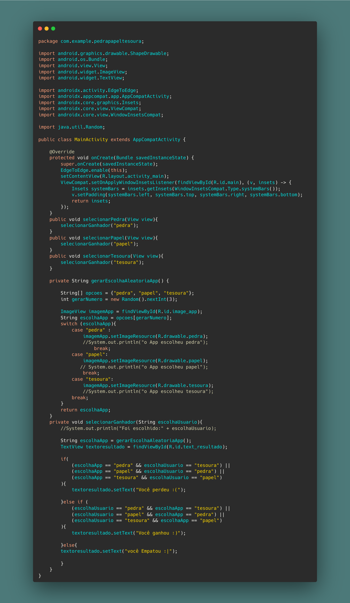
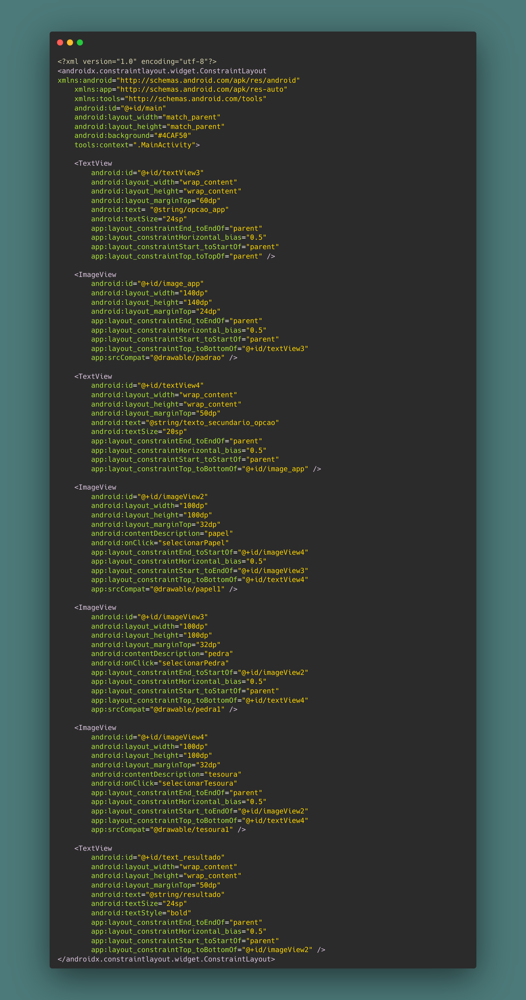

<h1>AppPedraPapelTesoura</h1>

[Apresentação por vídeo](https://github.com/user-attachments/assets/e08eff62-45b6-4b6c-a789-22247e530f2d)

<h3>Codigo Java</h3>

todo a lógica para a criação do App

<h3>Codigo XML</h3>

neste arquivo vai as imagens com interatividades de click e os texto. <b>obs:</b>Poderia ser feito com botões ao invés de imagens

